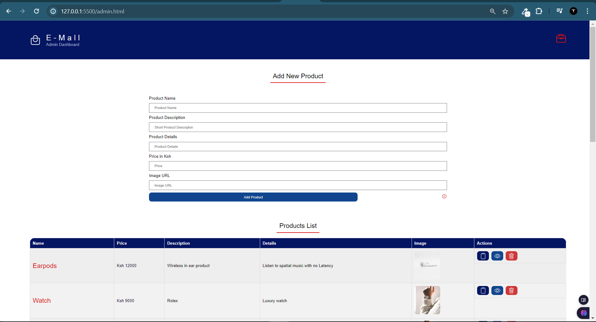
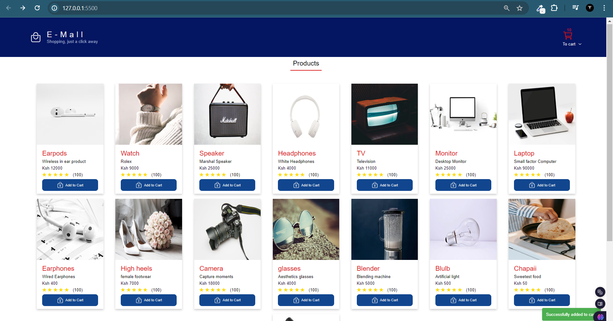
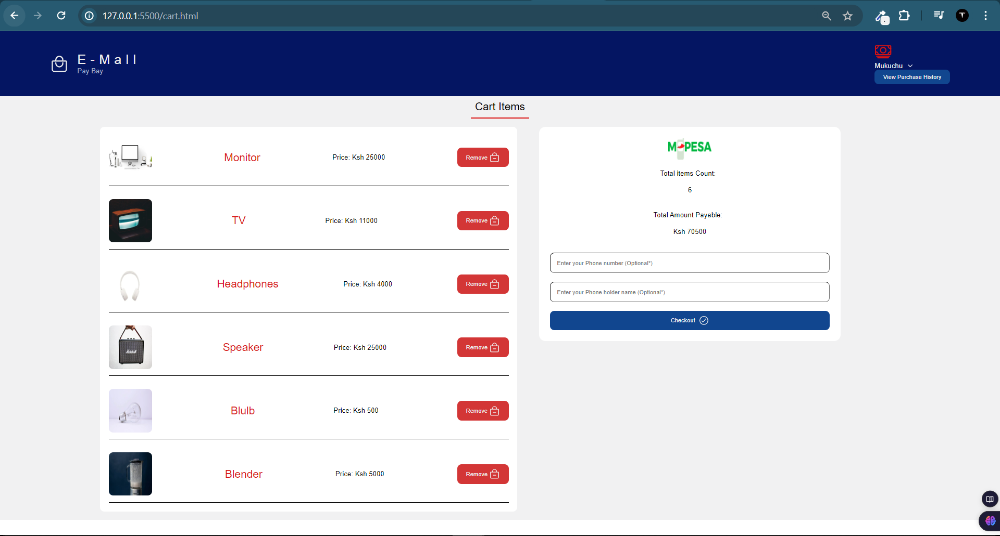

Sure, here's the updated README file with instructions on how to set up the project using JSON Server:

````markdown
# eCommerce

### E-Mall

## Table of contents

- [Overview](#overview)
  - [Features](#features)
  - [Screenshot](#screenshot)
  - [Links](#links)
  - [Setup](#setup)
- [Built with](#built-with)
- [What I learned](#what-i-learned)
- [Author](#author)

## Overview

E-Mall is an online e-commerce application designed to provide a seamless shopping experience. Users can browse products, add them to the cart, view cart items, and proceed to checkout. The app also allows users to view their purchase history.

### Features

- Display a list of products.
- Add products to the cart.
- View items in the cart.
- Checkout and process orders.
- View purchase history.

### Screenshot





### Links

- Solution URL: [E-Mall Source Code](https://github.com/teach2giveChuka/eCommerce)

### Setup

To set up this project locally, follow these steps:

1. **Clone the repository:**

   ```bash
   git clone https://github.com/teach2giveChuka/eCommerce.git
   cd eCommerce
   ```

2. **Install JSON Server:**

   ```bash
   npm install -g json-server
   ```

3. **Start JSON Server:**

   ```bash
   json-server --watch db.json --port 3000
   ```

4. **Open `index.html` in your browser:**
   Simply open the `index.html` file in your web browser to view the application.

## Built with

- Semantic HTML5 markup
- Vanilla CSS
- Vanilla JavaScript (ES6)
- Local Storage for data persistence

## What I learned

During the development of this e-commerce project, I enhanced my skills in:

- Managing state and data persistence using localStorage.
- Dynamically updating the DOM based on user interactions.
- Handling forms and events in JavaScript.
- Creating and manipulating modals for a better user experience.
- Implementing a basic checkout flow with user feedback.

## Author

- GitHub: [Your-Username](https://github.com/teach2giveChuka/eCommerce)
````
